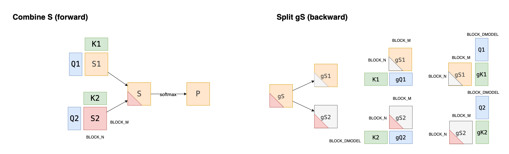
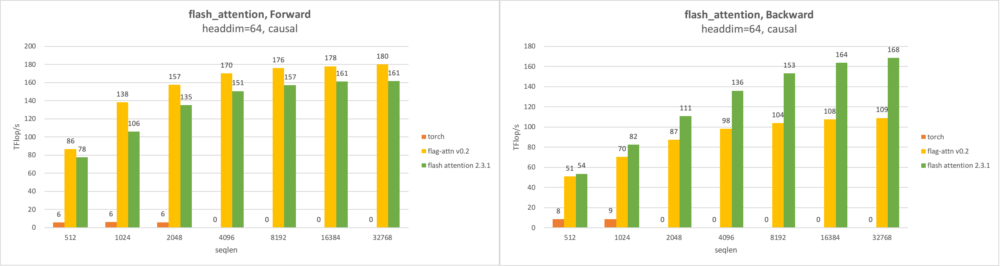
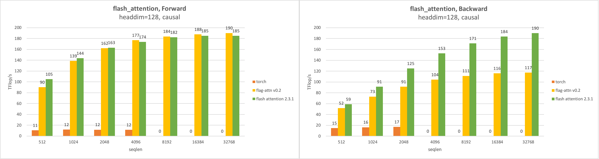
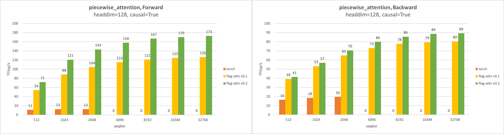

# FlagAttention

[中文版](./README_cn.md)

FlagAttention is a project for memory-efficient attention operators implemented in the [Triton language](https://github.com/openai/triton). Motivated by the need of non-standard attention operators in language modeling, it starts as an extension to multi-head attention.

It is memory-efficient like [FlashAttention](https://arxiv.org/abs/2205.14135) and [FlashAttention v2](https://tridao.me/publications/flash2/flash2.pdf) in that it save memory footprint and traffic. Implemented in the Triton language, it is easier to understand and modify. The original implementation of FlashAttention in CUDA([flash-attention](https://github.com/Dao-AILab/flash-attention)) provides a good example on how to design an algorithm that takes different levels of memory into account. By tiling and re-computation, FlashAttention avoids materializing the attention scores, whose capacity is proportional to the square of the sequence length. However, custom transformation to the attention scores is not possible when using FlashAttention, unless it is supported by FlashAttention out-of-the-box.
While extending FlashAttention requires proficiency in CUDA programming, FlagAttention implemented in the Triton language is easier to modify.

FlagAttention provides two operators now.

1. flash_attention. The implementation of FlashAttention in the Triton language.
2. piecewise_attention. It is currently used to implement NLPE(non linear position embddding), which is used in the training and inference in the [Aquila-2-34B](https://github.com/FlagAI-Open/Aquila2) model.

When further customization is needed, FlagAttention servers as an example.

## Requirements

FlagAttention requires Pytorch and Triton. To use the new features of Triton, a nightly release is recommended.


```sh
pip install -U --index-url https://aiinfra.pkgs.visualstudio.com/PublicPackages/_packaging/Triton-Nightly/pypi/simple/ triton-nightly
```

FlagAttention requires Ampere Nvidia GPUs(e.g. A100, RTX-3090, ...) and CUDA Toolkit 11.6 or above. Other GPUs may work but have not been tested yet.

## Installation

FlagAttention can be installed in either way below.

1. Editable Installation. Changes to the code in local source tree are effective without re-installation.
2. Build a distribution and then install. Only the package is installed.

### Editable Installation

Editable installation with pip.

```sh
git clone https://github.com/FlagOpen/FlagAttention && cd FlagAttention
pip install -e .
```

### Build a Distribution & Install

Following modern python packaging convention, FlagAttention is configured by [`pyproject.toml`](https://pip.pypa.io/en/stable/reference/build-system/pyproject-toml/), and no `setup.py` is provided. To build a distribution, either a source distribution or a binary distribution, python package `build` is recommended.

First, install `build` package via pip.

```sh
pip install build
```

Then build the package.

```sh
git clone https://github.com/FlagOpen/FlagAttention && cd FlagAttention
# to build in `no-isolation` mode requires installing build requirements manually
pip install -U setuptools setuptools-scm
python -m build --no-isolation
```

The built package is in `dist/` for installation.

```sh
pip install dist/flag_attn-xxx.whl
```

## Usage

FlagAttention provides customized attention operators. When an operator is equivalent to a torch function, it can be used as a drop-in replacement.

## Run the Tests

A recent version of `pytest`(>=7.1.0) is required to run the tests in `tests/`. Operators in `FlagAttention` are tested against [reference implementations](src/flag_attn/testing) in Pytorch provided by `flag_attn.testing`, both for the forward and the backward operators. For operators with support for inputs of `float16` or `bfloat16`, three different implementations are included for numerical accuracy testing.

1. The implementation used as reference is an implementation in PyTorch which upcasts the inputs to `float32` and performs the computations in `float32` all the way through before casting the outputs to `float16` or `bfloat16`. 
2. The implementation in Triton usually uses `float16` or `bfloat16` for mma(matrix multiplication accumulation) inputs, and `float32` for mma outputs and other computations.
3. The implementation for comparison is an implementation in PyTorch, with the same computation as the reference, except that the precision is the same as the Triton implementation.

The tests for numerical accuracy enforce that the max difference between the Triton implementation and reference implementation is not greater than twice the max difference between the Pytorch implementation and reference implementation.

```sh
pytest .
```

## Run the Benchmark

Benchmarks are provided to measure the achieved TFLOPs/s. FLOPs/s is used as a metric for speed of the operator. To calculate the FLOPs of an operator, only matmul is counted. The FLOPs is divided by the median runtime to get the achieved FLOPs/s.

We benchmark operators in Triton implementation against a reference implementation in Pytorch. When the input size is large, the reference implementation in Pytorch runs out of memory. In such cases, the FLOP/s is treated as zero.

```sh
cd benchmarks/
python flash_benchmark.py
python piecewise_benchmark.py
```

## Operators

### flash_attention

The implementation of FlashAttention in the Triton language. The interface is.

```python
flash_attention(q, k, v, causal=False, sm_scale=None)
```

### piecewise_attention

The first extension to FlashAttention is [piecewise_attention](src/flag_attn/piecewise.py).

The interface is shown below.

```python
piecewise_attention(q1, k1, q2, k2, v, dist_threshold, causal=False, sm_scale=None)
```

It is named `piecewise_attention` in that it takes two `q`'s and two `k`'s to compute attention scores(S) before applying softmax to get the attention weights(P). The design originates from the fact that a transformer with rotary position embedding is not good at predicting sequences longer than the longest sequence that it is trained on. Pairs of (q, k) get unexpectedly high attention scores when the distance is greater than the maximum sequence length in the training set. A proposal to solve the problem is to compute the attention score in different ways, depending on whether the distance between `q` and `k` is greater than a threshold.

NLPE(non linear position embedding) proposed by BAAI applies two different position embeddings to `q` and `k` get `q1, q2` and `k1, k2`. Then the attention score is computed as the dot product of `q1, k1` or `q2, k2` depending on the distance between `q` and `k`.



#### Usage

```python
# piecewise_attention
import torch
from flag_attn import piecewise_attention

B, H, T, D = 2, 16, 8192, 128
dist_threshold = T // 2

q1 = torch.randn((B, H, T, D), dtype=torch.float16, device="cuda:0").requires_grad_()
q2 = torch.randn((B, H, T, D), dtype=torch.float16, device="cuda:0").requires_grad_()
k1 = torch.randn((B, H, T, D), dtype=torch.float16, device="cuda:0").requires_grad_()
k2 = torch.randn((B, H, T, D), dtype=torch.float16, device="cuda:0").requires_grad_()
v = torch.randn((B, H, T, D), dtype=torch.float16, device="cuda:0").requires_grad_()
o = piecewise_attention(q1, k1, q2, k2, v, dist_threshold, causal=True)
print(o)

go = torch.randn((B, H, T, D), dtype=torch.float16, device="cuda:0")
gq1, gk1, gq2, gk2, gv = torch.autograd.grad(
    o, (q1, k1, q2, k2, v), go
)
print(gq1)
```

```python
# flash_attention
import torch
from flag_attn import flash_attention

B, H, T, D = 2, 16, 8192, 128

q = torch.randn((B, H, T, D), dtype=torch.float16, device="cuda:0").requires_grad_()
k = torch.randn((B, H, T, D), dtype=torch.float16, device="cuda:0").requires_grad_()
v = torch.randn((B, H, T, D), dtype=torch.float16, device="cuda:0").requires_grad_()
o = flash_attention(q, k, v, causal=True)
print(o)

go = torch.randn((B, H, T, D), dtype=torch.float16, device="cuda:0")
gq, gk, gv = torch.autograd.grad(
    o, (q, k, v), go
)
print(gq)
```

#### Performance

Benchmark is performed under such conditions.

1. seqlen in `[512, 1k, 2k, 4k, 16k, 32k]`;
2. batch size: `32k / seqlen`;
3. headdim in`[64, 128]`；
4. num_heads: `2048 / headdim`.

##### flash_attention

The performance of flash_attention with causal masking is shown below.





The forward operator runs as fast as, and in some cases, faster than FlashAttention(CUDA). However, the backward operator is generally slower than FlashAttention. We at first following the paper and update the gradient of Q with atomic addition, which runs extremely slow. Then we split the backward into two kernels, one to compute the gradient of k and v, the other to compute the gradient of q. It avoids atomic addition, but adds more re-computation. This bring a 4x to 5x speedup in the backward operator, thought still slower than FlashAttention(CUDA).

We apply the same split kernel trick to piecewise_attention, too.

##### piecewise_attention

The performance of piecewise_attention has improved compared to that in v0.1. In the case where the head dim is 128 and causal masking is applied, the forward and backward operator is faster than that in v0.1 by 36% and 9%, respectively.



#### Features

- support for [Nvidia](https://www.nvidia.com/) Ampere GPU(Tested on RTX-3090 and A100)；
- support for [Iluvatar CoreX](https://www.iluvatar.com/) GPU(Tested on Iluvatar CoreX MR-V100)；
- data type support, float16 and bfloat16 for Ampere Nvidia GPUs;
- support causal and non-causal modes;
- support forward & backward modes;
- the sequence length of k/v can be larger than that of q.

#### Limitations

- `headdim` should be in `[16, 32, 64, 128]`.
- dropout of attention weights is not supported yet.

## TODOs

1. Test on other GPUs;
2. Test on more triton versions；
3. Improve performance of attention operators(especially for the backward op).
4. Support other extensions to flash attention.
