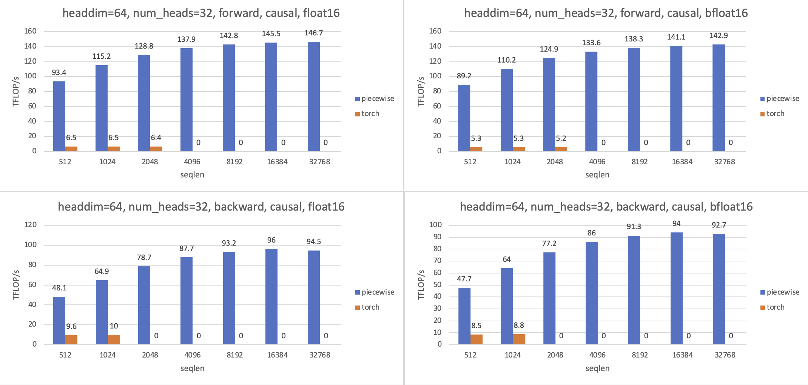
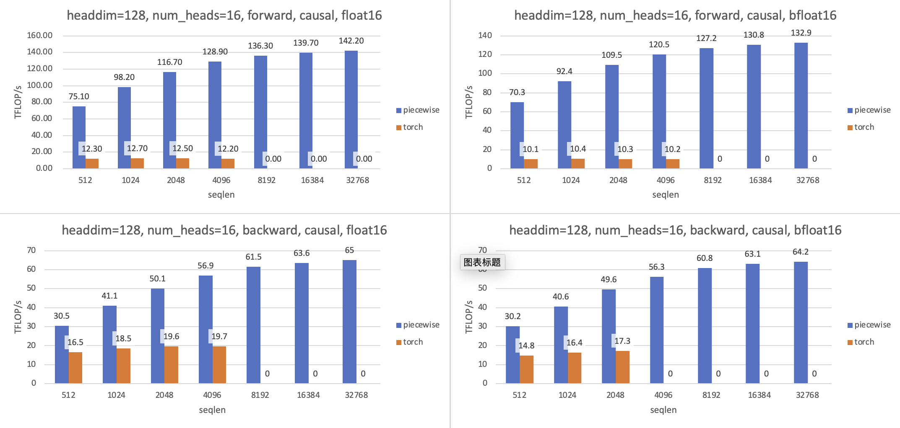

# FlagAttention

[English](./README.md)

FlagAttention 是一个用 Triton 语言实现的内存高效 Attention 算子项目。FlagAttention 受到 [FlashAttention](https://arxiv.org/abs/2205.14135) 和 [FlashAttention v2](https://tridao.me/publications/flash2/flash2.pdf) 的启发，并从大型语言建模研究的具体需求出发扩展它的功能。FlashAttention 和 FlashAttention-2 可以节省内存占用和访存以提高内存效率，但要对它们进行修改，添加更多选项和功能，则需要熟练的 cuda 编程技能。因此，FlagAttention 使用 Triton 来语言实现，它更便于编写自定义 GPU kernel。

FlagAttention 提供的算子具有和 FlashAttention 相似的访存高效、运行速度快的特点，可以支持大语言模型在长文本上的训练和推理。作为开箱即用的高效 Attention 算子库，FlagAttention 寻求高效和泛用性之间的平衡点，对基础功能进行扩展，而不是针对某个特定模型为其定义所有细节。目前其中的 PiecewiseAttention 用于 [Aquila 34B](https://github.com/FlagAI-Open/Aquila2) 模型的推理，但这个算子也可以用于其他模型。

如果需要更多的定制和修改，FlagAttention 中的算子实现也可以作为参考或修改的起点。

## 依赖

FlagAttention 依赖 Torch 和 Triton。 为了使用 Triton 的新功能，建议使用 nightly 版。

安装 Torch nightly 的指令可见 https://pytorch.org/get-started/locally/, Triton 现在是 Torch nightly 的依赖，所以可以自动随 Torch 安装。

FlagAttention 需要 Ampere 架构的 Nvidia GPU (e.g. A100, RTX-3090, ...) 以及 CUDA Toolkit 11.6 及以上的版本运行。其他的 GPU 可能也能运行，但暂未测试。

## 安装

FlagAttention 可以通过以下两种方式安装。

1. 可编辑安装。对本地代码的修改会立即生效，无需重新安装。
2. 构建并安装。这种方式只有 `flag_attn` 包的内容会被安装。

### 可编辑安装

通过 `pip` 进行可编辑安装

```sh
git clone https://github.com/FlagOpen/FlagAttention && cd FlagAttention
pip install -e .
```

### 构建并安装

遵循现代 python 打包惯例，FlagAttention 通过 [`pyproject.toml`](https://pip.pypa.io/en/stable/reference/build-system/pyproject-toml/) 文件来配置，因此没有 `setup.py`. 推荐使用 python 的 `build` 包来构建发行版，包括源码发行版(sdist) 和二进制发行版(whl).

首先通过 pip 安装 `build` 包。

```sh
pip install build
```

然后构建包。

```sh
git clone https://github.com/FlagOpen/FlagAttention && cd FlagAttention
python -m build --no-isolation
```

构建好的包在 `dist/` 目录，可用于安装。

```sh
pip install dist/flag_attn-xxx.whl
```

## 使用方式

FlagAttention 提供了自定义的 attention 算子。当一个算子的功能和 torch 函数等价的时候，就可以用它替换对应的 torch 函数。 

## 运行测试

需要较新版本的 `pytest`(>=7.1.0) 以运行 `tests/` 中的测试。FlagAttention 中的运算符针对 PyTorch 中的[参考实现](tests/flag_attn/ref_impl/) 进行测试，包括前向和反向。对于 `float16` 和 `bfloat16`，我们将绝对公差和相对公差设置为 `1e-2` 和 `1e-3`。

```sh
pytest .
```

## 运行性能测试

项目中提供了性能基准测试来衡量算子所能达到的的 TFLOPs/s。FLOPs/s 用来作为衡量算子运行速度的指标。算子的浮点数运算总量 (FLOPs) 时，仅计算矩阵乘。总计算量除以运行时间的中位数，得到算子运行的 FLOPs/s。

我们对比了算子的 Triton 实现和 PyTorch 参考实现的性能。当输入规模较大时，PyTorch 参考实现会遇到内存不足的问题，这种情况下，FLOPs/s 记为 0.

我们也提供在相同输入规模下的 `Flash Attention v2` (https://github.com/Dao-AILab/flash-attention, v2.2.3) 的速度作为性能参考。但由于 FlagAttention 中的算子和 FlashAttention 有一定差别，因此即使批量大小、序列长度、头部数量、头部尺寸和其他配置相同，计算总量也会有所不同。

## 算子

### Piecewise Attention

对 Flash Attention 的第一个扩展是 [piecewise attention](src/flag_attn/piecewise.py).

接口如下：

```python
piecewise_attention(q1, k1, q2, k2, v, dist_threshold, softmax_scale=None, causal=False)
```

它被命名为 piecewise_attention (分段 attention)，因为在通过 softmax 得到 attention weights (P) 之前，它需要两个`q` 和两个 `k` 来计算 attention score (S)。这样的设计源于具有旋转位置嵌入的 Transformer 不擅长预测比训练集中更长的序列。当距离大于训练集中的最大序列长度时，这样的 (q,k) 对会得到较高的 attention score，这是不符合预期的现象。解决这个问题的一种方式是设定一个距离阈值，根据取 `q` 和 `k` 之间的距离是否大于阈值，以不同的方式计算 attention score。

在实践中，可以先对 `q` 和 `k`用两种不同的方式进行预处理，以获得 `q1, q2` 和 `k1, k2`。然后，根据取 `q` 和 `k` 之间的距离是否大于阈值，选择使用 `q1, k1` 或者 `q2, k2` 计算内积。


#### 使用示例

```python
from flag_attn import piecewise_attn

B, H, T, D = 2, 16, 8192, 128
sm_scale = 1. / math.sqrt(D)
dist_threshold = T // 2

q1 = torch.randn((B, H, T, D), dtype=torch.float16, device="cuda:0")
q2 = torch.randn((B, H, T, D), dtype=torch.float16, device="cuda:0")
k1 = torch.randn((B, H, T, D), dtype=torch.float16, device="cuda:0")
k2 = torch.randn((B, H, T, D), dtype=torch.float16, device="cuda:0")
v = torch.randn((B, H, T, D), dtype=torch.float16, device="cuda:0")
o = piecewise_attn(q1, k1, q2, k2, v, dist_threshold, causal=True, sm_scale=sm_scale)
print(o)
```

#### 性能

下面展示 A100 上使用 causal 模式的 piecewise_attention 的正向和反向算子的性能。测试参数如下：

1. seqlen 为 512, 1k, 2k, 4k, 16k, 32k;
2. batch size 为 32k / seqlen;
3. headdim 为 64, 128；
4. num_heads 为 2048 / headdim.

Headdim=64


---

Headdim=128


#### 特征

- 支持[英伟达](https://www.nvidia.com/) 安培架构的 GPU(在 RTX-3090, A100 上验证)；
- 支持[天数智芯](https://www.iluvatar.com/)的 GPU(在 MR-V100 上验证)；
- 数据类型支持，float16, 在英伟达安培架构 GPU 上也支持 bfloat16；
- 支持 causal 和非 causal 模式；
- 支持前向和反向计算；
- K/V 的序列长度可以大于 Q 的序列长度。

#### 限制

- headdim 必须为 `[16, 32, 64, 128]` 之一；
- 尚未支持对 attention weight 使用 dropout。

## TODOs

1. 在其他 GPU 上测试；
2. 在更多 Triton 版本上进行测试；
3. 提高算子的性能；
2. 支持对 FlashAttention 的其他功能扩展。
