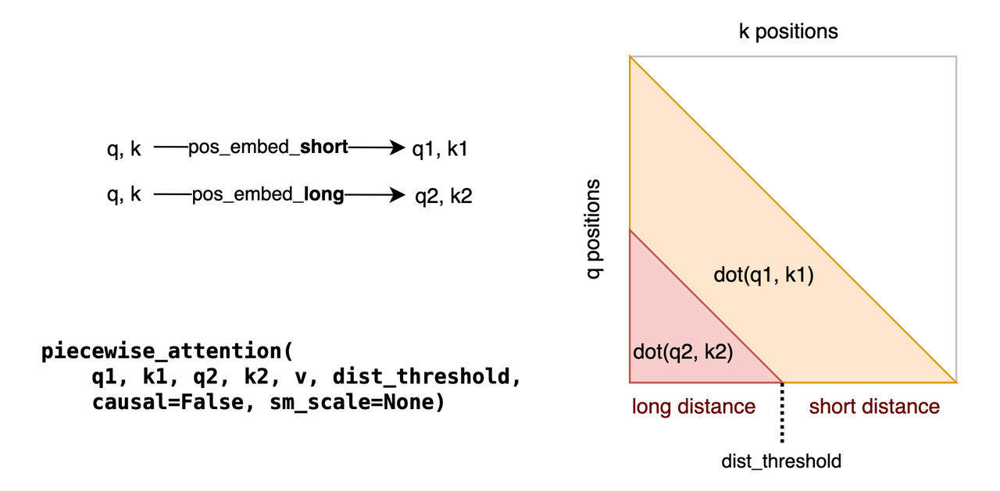
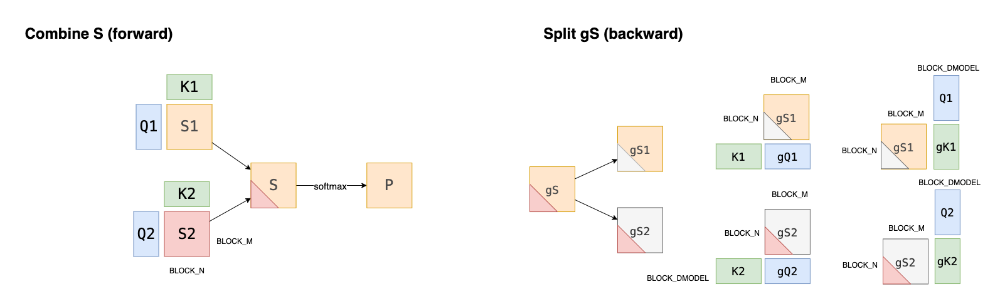
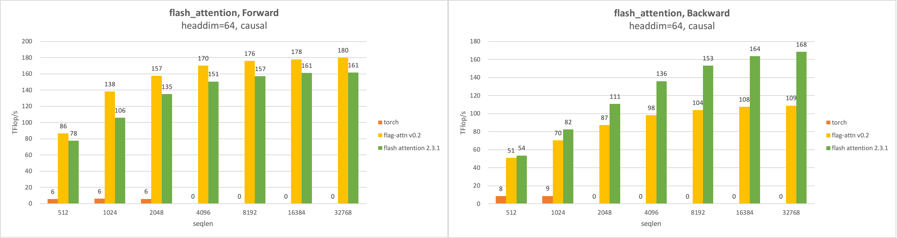
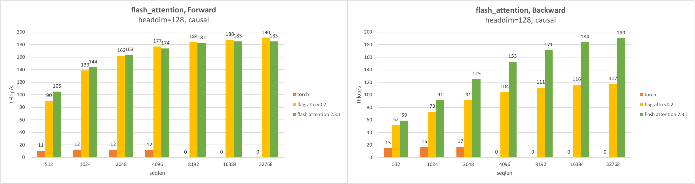
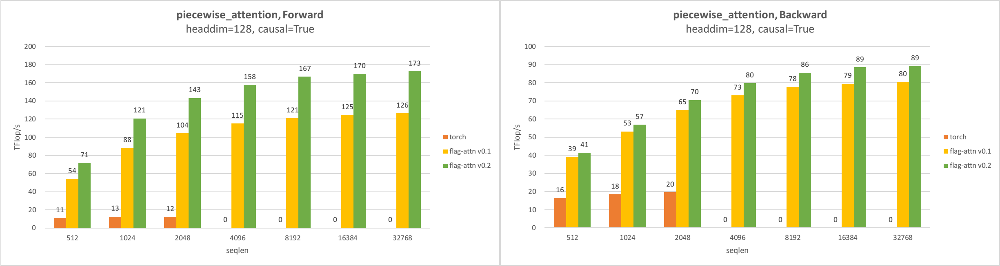

# FlagAttention

[English](./README.md)


FlagAttention 是一个用 Triton 语言(https://github.com/openai/triton)实现的内存高效 Attention 算子项目。FlagAttention 由语言模型中对非标准 attention 算子的需求驱动，对 multihead attention 算子进行扩展。

FlagAttention 和 [FlashAttention](https://arxiv.org/abs/2205.14135) 和 [FlashAttention v2](https://tridao.me/publications/flash2/flash2.pdf) 一样内存高效，可以节省内存占用和访存。因为使用 Triton 语言实现，它更容易理解和修改。原版的 CUDA 实现的 [FlashAttention](https://github.com/Dao-AILab/flash-attention) 提供了如何设计算法以考虑不同内存层级的良好范例。通过分块和重计算的技巧， FlashAttention 避免了实体化 attention score 这个容量和文本长度的平方成正比的中间变量。但是使用 FlashAttention 的时候，无法对 attention score 进行自定义的变换，除非这个变换本身就被 FlashAttention 支持。对 FlashAttention 算子进行扩展需要熟练的 CUDA 编程技巧， 但用 Triton 语言实现的 FlagAttention 则更好修改。

FlagAttention 目前提供了两个算子。

1. flash_attention. 用 Triton 语言实现的 FlashAttention.
2. piecewise_attention. 这个算子用于实现 NLPE(non linear position embedding)，目前用于 [Aquila-2-34B](https://github.com/FlagAI-Open/Aquila2) 模型的训练和推理。

如果需要更多的定制，FlagAttention 中的算子实现也可以作为参考。

## 依赖

FlagAttention 依赖 Torch 和 Triton。 为了使用 Triton 的新功能，建议使用 nightly 版。

```sh
pip install -U --index-url https://aiinfra.pkgs.visualstudio.com/PublicPackages/_packaging/Triton-Nightly/pypi/simple/ triton-nightly
```
FlagAttention 需要 Ampere 架构的 Nvidia GPU (e.g. A100, RTX-3090, ...) 以及 CUDA Toolkit 11.6 及以上的版本运行。其他的 GPU 可能也能运行，但暂未测试。

## 安装

FlagAttention 可以通过以下两种方式安装。

1. 可编辑安装。对本地代码的修改会立即生效，无需重新安装。
2. 构建并安装。这种方式只有 `flag_attn` 包的内容会被安装。

### 可编辑安装

通过 `pip` 进行可编辑安装

```sh
git clone https://github.com/FlagOpen/FlagAttention && cd FlagAttention
pip install -e .
```

### 构建并安装

遵循现代 python 打包惯例，FlagAttention 通过 [`pyproject.toml`](https://pip.pypa.io/en/stable/reference/build-system/pyproject-toml/) 文件来配置，因此没有 `setup.py`. 推荐使用 python 的 `build` 包来构建发行版，包括源码发行版(sdist) 和二进制发行版(whl).

首先通过 pip 安装 `build` 包。

```sh
pip install build
```

然后构建包。

```sh
git clone https://github.com/FlagOpen/FlagAttention && cd FlagAttention
# 以非隔离模式安装需要自行安装依赖
pip install -U setuptools setuptools-scm
python -m build --no-isolation
```

构建好的包在 `dist/` 目录，可用于安装。

```sh
pip install dist/flag_attn-xxx.whl
```

## 使用方式

FlagAttention 提供了自定义的 attention 算子。当一个算子的功能和 torch 函数等价的时候，就可以用它替换对应的 torch 函数。 

## 运行测试

需要较新版本的 `pytest`(>=7.1.0) 以运行 `tests/` 中的测试。FlagAttention 中的运算符以 `flag_attn.testing` 中的 PyTorch [参考实现](src/flag_attn/testing) 为参考进行测试，包括前向和反向。对于支持 `float16` 和 `bfloat16` 数据类型的算子，测试中包含了三种实现用于对比。

1. **Pytorch 参考实现**：在这个实现中，输入先被转换为 `float32` 类型，此后全程使用 `float32` 进行运算，再将结果转换为 `float16` 或 `bfloat16` 类型。
2. **Triton 实现**: 算子的 Triton 实现，使用 `float16` 或 `bfloat16` 作为矩阵乘(MMA)的输入类型，而使用 `float32` 作为矩阵乘的输出类型，以及其他运算的计算类型。
3. **Pytorch 实现**： 这个实现使用和 Pytorch 参考实现相同的运算，但计算精度和 Triton 实现一致。

我们的测试要求在相同情况下，Triton 实现与 Pytorch 参考实现之间的最大误差不大于 Pytorch 实现与 Pytorch 参考实现之间最大误差的两倍。

```sh
pytest .
```

## 运行性能测试

项目中提供了性能基准测试来衡量算子所能达到的的 TFLOPs/s。FLOPs/s 用来作为衡量算子运行速度的指标。算子的浮点数运算总量 (FLOPs) 仅考虑矩阵乘。总计算量除以运行时间的中位数，得到算子运行的 FLOPs/s。

我们对比了算子的 Triton 实现和 PyTorch 实现的性能。当输入规模较大时，PyTorch 参考实现会遇到内存不足的问题，这种情况下，FLOPs/s 记为 0.

```sh
cd benchmarks/
python flash_benchmark.py
python piecewise_benchmark.py
```

## 算子

### flash_attention

Triton 语言实现的 FlashAttention, 接口如下。

```python
flash_attention(q, k, v, causal=False, sm_scale=None, return_log_normalizer=False, return_total_attention=False)
```

除了 attention 的输出之外，它还可以根据 `return_log_normalizer` 和 `return_total_attention=False` 返回一些额外的输出。

1. log_normalizer: 形状 (batch_size, num_heads, seqlen_q), attention 运算内部的 softmax 运算的 log normalizer.
2. total_attention: 形状 (batch_size, num_heads, seqlen_k). attention weights 沿着 q 的序列轴上求和的结果。

### piecewise_attention

对 FlashAttention 的第一个扩展是 [piecewise attention](src/flag_attn/piecewise.py). 该算子增强了 FlashAttention 的功能：使用两个 `q` 和两个 `k` 来计算 attention score(S) ，然后使用 softmax 来计算 attention weight(P).

这个设计源于具有旋转位置编码的 Transformer 模型在预测的序列长度超过其最大训练序列长度时存在困难。当距离超过训练集中最大序列长度是，这样的 (q,k) 对会得到较高的 attention score，这是不符合预期的现象。

为了解决这个，BAAI提出了 NLPE(Non-Linearized Position Embedding, 非线性位置编码)。该方法根据q和k之间的距离是否超过预定义的阈值，为q和k应用两个不同的位置嵌入，产生q1, q2和k1, k2。然后，根据q和k之间的距离，注意力得分计算为q1, k1或q2, k2的点积。

接口如下：



```python
piecewise_attention(q1, k1, q2, k2, v, dist_threshold, softmax_scale=None, causal=False)
```



#### 使用示例

```python
# piecewise_attention
import torch
from flag_attn import piecewise_attention

B, H, T, D = 2, 16, 8192, 128
dist_threshold = T // 2

q1 = torch.randn((B, H, T, D), dtype=torch.float16, device="cuda:0").requires_grad_()
q2 = torch.randn((B, H, T, D), dtype=torch.float16, device="cuda:0").requires_grad_()
k1 = torch.randn((B, H, T, D), dtype=torch.float16, device="cuda:0").requires_grad_()
k2 = torch.randn((B, H, T, D), dtype=torch.float16, device="cuda:0").requires_grad_()
v = torch.randn((B, H, T, D), dtype=torch.float16, device="cuda:0").requires_grad_()
o = piecewise_attention(q1, k1, q2, k2, v, dist_threshold, causal=True)
print(o)

go = torch.randn((B, H, T, D), dtype=torch.float16, device="cuda:0")
gq1, gk1, gq2, gk2, gv = torch.autograd.grad(
    o, (q1, k1, q2, k2, v), go
)
print(gq1)
```

```python
# flash_attention
import torch
from flag_attn import flash_attention

B, H, T, D = 2, 16, 8192, 128

q = torch.randn((B, H, T, D), dtype=torch.float16, device="cuda:0").requires_grad_()
k = torch.randn((B, H, T, D), dtype=torch.float16, device="cuda:0").requires_grad_()
v = torch.randn((B, H, T, D), dtype=torch.float16, device="cuda:0").requires_grad_()
o = flash_attention(q, k, v, causal=True)
print(o)

go = torch.randn((B, H, T, D), dtype=torch.float16, device="cuda:0")
gq, gk, gv = torch.autograd.grad(
    o, (q, k, v), go
)
print(gq)
```

#### 性能

性能测试条件如下：

1. seqlen 为 `[512, 1k, 2k, 4k, 16k, 32k]`;
2. batch size 为 `32k / seqlen`;
3. headdim 为 `[64, 128]`；
4. num_heads 为 `2048 / headdim`.

##### flash_attention

在使用 causal masking 条件下， flash_attention 算子性能如下：





前向算子和 FlashAttention(CUDA) 一样快，甚至在某些情况下比 FlashAttention(CUDA)更快。但反向算子比 FlashAttention 慢。一开始的实现中，我们依照论文中的使用原子加的方式更新 q 的梯度，但这样运行非常慢。所以我们将反向的 kernel 分成两个，一个用来计算 k&v 的梯度，一个用来计算 q 的梯度。这避免了原子加运算，但是增加了更多的重计算。这样的修改将反向算子速度提升到了 4~5 倍，但仍然比 FlashAttention 慢。

相同的技巧也用在了 piecewise_attention 上。

##### piecewise_attention

相比 v0.1, piecewise_attention 算子的性能得到了提升。在 head dim 为 128 且使用 causal masking 的情况下，正向和反向算子的速度分别提升了 36% 和 9%.



#### 特征

- 支持[英伟达](https://www.nvidia.com/) 安培架构的 GPU(在 RTX-3090, A100 上验证)；
- 支持[天数智芯](https://www.iluvatar.com/)的 GPU(在 MR-V100 上验证)；
- 数据类型支持，float16, 在英伟达安培架构 GPU 上也支持 bfloat16；
- 支持 causal 和非 causal 模式；
- 支持前向和反向计算；
- K/V 的序列长度可以大于 Q 的序列长度。

#### 限制

- `headdim` 必须为 `[16, 32, 64, 128]` 之一；
- 尚未支持对 attention weight 使用 dropout。

## TODOs

1. 在其他 GPU 上测试；
2. 在更多 Triton 版本上进行测试；
3. 提高算子的性能；
4. 支持对 FlashAttention 的其他功能扩展。
